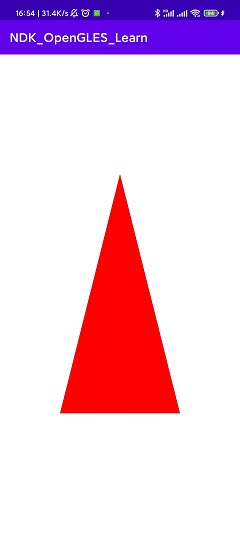

## 你好, 三角形

这个笔记旨在记录创建OpenGL ES3的项目并渲染三角形的过程。

如果您先前没有OpenGL或者OpenGL ES的基础，您可以先跟着以下的步骤去完成一下。

各个步骤，如果您有不了解的地方，可以继续阅读后文，或者阅读[README.md](../README.md)中的参考资料。

### 初始化项目

新建`Empty Project`的Android项目之后，新建一个`Native Library`作为编写OpenGL ES代码的模块。


修改默认的项目配置: 

1. 重命名`NativeLib.kt`为`MyNativeRender.kt`
2. 重命名CMake项目名：
    ```
   # CMakeList.txt
    project("glnative-render")
   ```
   记得也要修改对应的kt代码：
    ```
   // MyNativeRender.kt
    System.loadLibrary("glnative-render")
   ```

> 以上的配置可以根据自己的习惯进行调整，记录配置仅是为了后文做备忘

配置OpenGL ES3

```
#CMakeList.txt

target_link_libraries( # Specifies the target library.
   glnative-render

   # 添加链接库
   android
   GLESv3

   # Links the target library to the log library
   # included in the NDK.
   ${log-lib})
```

### 编写代码

`MyNativeRender.kt`: 

```kotlin
class MyNativeRender(context: Context) : GLSurfaceView.Renderer{
    // asset，主要用于加载shader、texture、font等资源
    private val mAssetMgr: AssetManager

    companion object {
        // Used to load the 'render' library on application startup.
        init {
            System.loadLibrary("glnative-render")
        }
    }

    /**
     * A native method that is implemented by the 'render' native library,
     * which is packaged with this application.
     */
    // 在Surface创建时调用
    private external fun glesCreate(gAssetMgr: AssetManager)
    // 在Surface变化时调用
    private external fun glesResize(width: Int, height: Int)
    // 在Surface渲染时调用
    private external fun glesDraw()

    init {
        mAssetMgr = context.assets
    }

    override fun onSurfaceCreated(gl: GL10?, config: EGLConfig?) {
        glesCreate(mAssetMgr)
    }

    override fun onSurfaceChanged(gl: GL10?, width: Int, height: Int) {
        glesResize(width, height)
    }

    override fun onDrawFrame(gl: GL10?) {
        glesDraw()
    }
}
```

编写顶点渲染器代码:

```glsl
#version 300 es
layout(location = 0) in vec4 vPosition;
void main()
{
   gl_Position = vPosition;
}

```

编写片段着色器代码:

```glsl
#version 300 es
precision mediump float;
out vec4 fragColor;
void main()
{
   fragColor = vec4(1.0, 0.0, 0.0, 1.0);
}
```

Native代码篇幅过长，可以查看:

[hello triangle.cpp](references/hello_triangle.cpp)

> 以上`hello_triangle.cpp`仅是备份起来用于参考，项目不会编译该文件。

编辑`MainActivity.kt`的代码

```kotlin

class MainActivity : AppCompatActivity() {
   companion object {
      private const val CONTEXT_CLIENT_VERSION = 3
   }

   private lateinit var mRender: MyNativeRender

   override fun onCreate(savedInstanceState: Bundle?) {
      super.onCreate(savedInstanceState)
      // 创建并配置GLSurfaceView
      val surface = GLSurfaceView(this)
      mRender = MyNativeRender(this)
      if(detectOpenGLES30()) {
         // 设置OpenGL ES版本
         surface.setEGLContextClientVersion(CONTEXT_CLIENT_VERSION)
         // 绑定render
         surface.setRenderer(mRender)
         // 设置渲染模式
         surface.renderMode = GLSurfaceView.RENDERMODE_WHEN_DIRTY
      } else {
         Log.e("MyNativeRender", "OpenGL ES 3.0 not supported on device.  Exiting...")
         finish()
      }

      setContentView(surface)
   }


   private fun detectOpenGLES30(): Boolean {
      val am = getSystemService(ACTIVITY_SERVICE) as ActivityManager
      val info = am.deviceConfigurationInfo
      return info.reqGlEsVersion >= 0x30000
   }
}
```

---

### 运行结果

